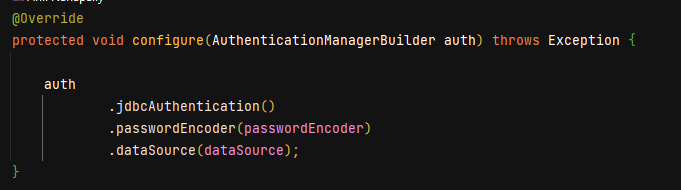
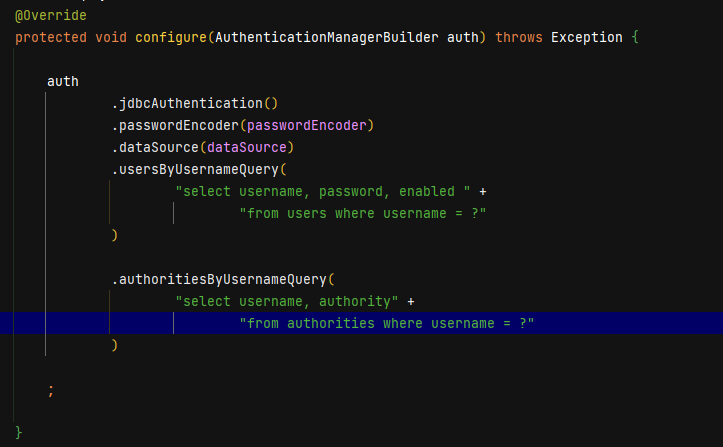

# Spring-Security-JDBC-Authentication 

* Create a new Project using [Spring Initializer Website](http://start.spring.io)
* Enter the Project Configuration Details

  
  
* Select Generate option and it will download the file
* Extract the downloaded file and open in your IDE (Intellij, Spring Tool Suite, Eclipse, Net Beans etc..)

* Create the Resource File (API End points). In my case I have created "**Home Resource**" Class.

# Spring Security Configuration

-> Create a Security Configuration Class
    Here, I am created ApplicationSecurityConfiguration class

-> Annotate class with EnableWebSecurity

-> Override the **AuthenticationManagerBuilder** configure method. Where I have configured the application to
authenticate the users using Jdbc DB Authentication and data source is by default configured by Spring for H2 Database.

-> Override the **HttpSecurity** configure method. It is used to authorize the every request and allows  who has the correct permission 

-> Run the application.

# JDBC Authentication Creation

Instead of using default schema created our own schemas.

-> Create a schema.sql under resources folder and type your **DDL Statements** It will be executed when the application is starting

-> Create a data.sql under resources folder and write your "**DML Statements**" It will be executed during runtime and result will be stored in database.

*** Updated Config Method AuthenticationManagerBuilder for JDBC Authentication ***

# Bonus Tip

If you want to create your own table names for authentication(Instead of users, authorities in **schema.sql**) you need to modify/add some statements for db lookup in config method
of AuthenticationManagerBuilder.

[For More Details Click Here... 😊😊😊](https://docs.spring.io/spring-security/reference/servlet/authentication/passwords/jdbc.html#servlet-authentication-jdbc)