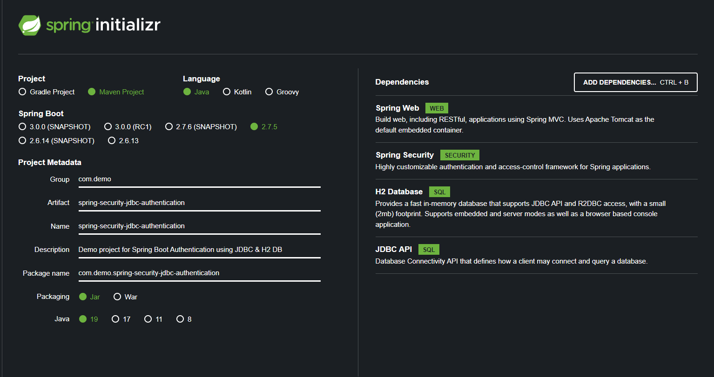
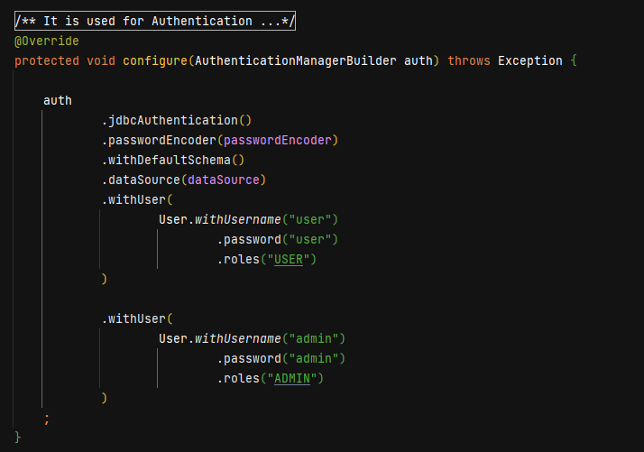
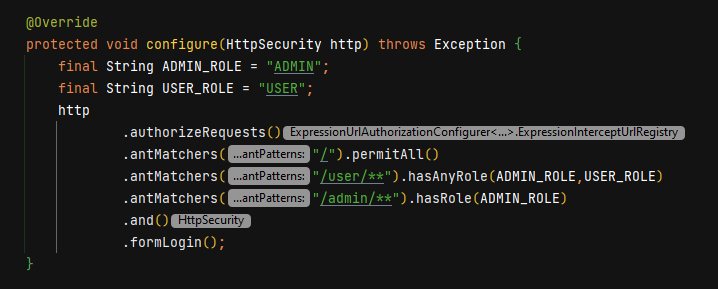

# Spring-Security-JDBC-Authentication

* Create a new Project using [Spring Initializer Website](http://start.spring.io)
* Enter the Project Configuration Details

  
  
* Select Generate option and it will download the file
* Extract the downloaded file and open in your IDE (Intellij, Spring Tool Suite, Eclipse, Net Beans etc..)

* Create the Resource File (API End points). In my case I have created "**Home Resource**" Class.

# Spring Security Configuration

-> Create a Security Configuration Class
    Here, I am created ApplicationSecurityConfiguration class

-> Annotate class with EnableWebSecurity

-> Override the **AuthenticationManagerBuilder** configure method. Where I have configured the application to
authenticate the users using Jdbc DB Authentication and data source is by default configured by Spring for H2 Database.

-> Override the **HttpSecurity** configure method. It is used to authorize the every request and allows  who has the correct permission 

-> Run the application.